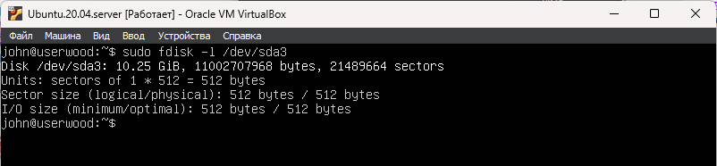

# Part 10. Использование утилиты fdisk

- вывести все разделы на выбранных устройствах или если устройств не задано, то на всех устройствах \
`sudo fdisk -l`

- отобразить информацию о выбранном устройстве **/dev/sda3** \
`sudo fdisk -l /dev/sda3`\
/dev/sda3 - название жесткого диска\
10,25GiB - размер жесткого диска\
21489664 - количество секторов\
swap не задан

 \
__**Здесь показана информация об устройсте /dev/sda3 **__
