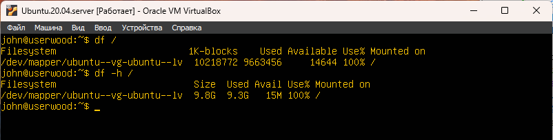
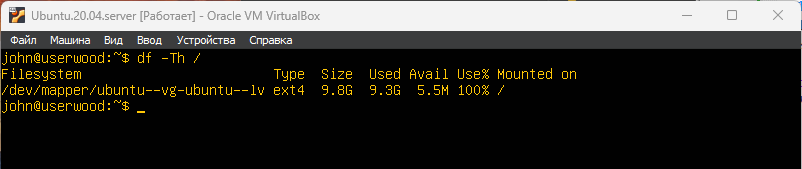

# Part 11. Использование утилиты df

## `df /`
- 10218772 Кб - размер диска.
- 9663456 Кб - занятое пространство.
- 14644 Кб - Свободное пространство.
- 100% - процент использования \
Единица измерения в отчете задана в Килобайтах = 1024 байт

 \
__**Здесь показана информация о корневом разделе диска **__

## `df -Th /`
Флаг -T (Show File System Type) добавляет колонку с типом файловой системы\
Флаг -h (Human-Readable) Отображает размеры в "человеко-читаемом" формате (с суффиксами K (килобайты), M (мегабайты), G (гигабайты)).

- 9,8G - размер диска в гигабайтах. 
- 9,3G - занятое пространство. 
- 5.5M - Свободное пространство в мегабайтах
- 100% - процент использования \
Тип файловой системы **ext4**

 \
__**Здесь показана информация о корневом разделе диска **__