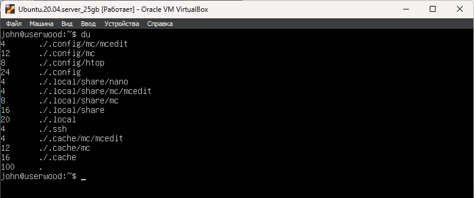
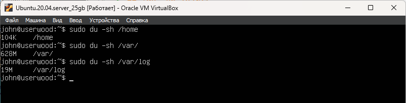
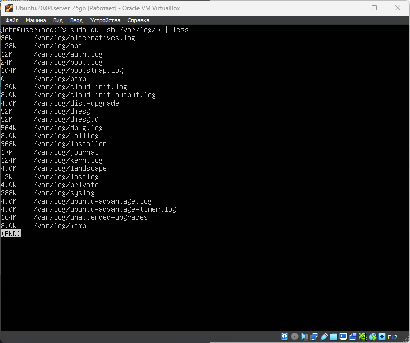

# Part 12. Использование утилиты du

## `du` - домашняя директория

 \ 

## 'du -sb /home /var/log /var' в байтах и человеко-читаемом виде
- -s -  показать только суммарный размер (без рекурсии в подпапки).
- -h - вывод в человеко-читаемом виде: Kb, Mb, Gb

 \ 

## 'du -sh /var/log/*' всё содержимое /var/log/

 \ 