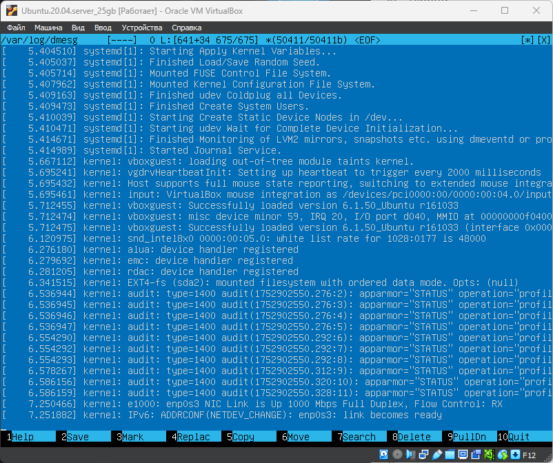
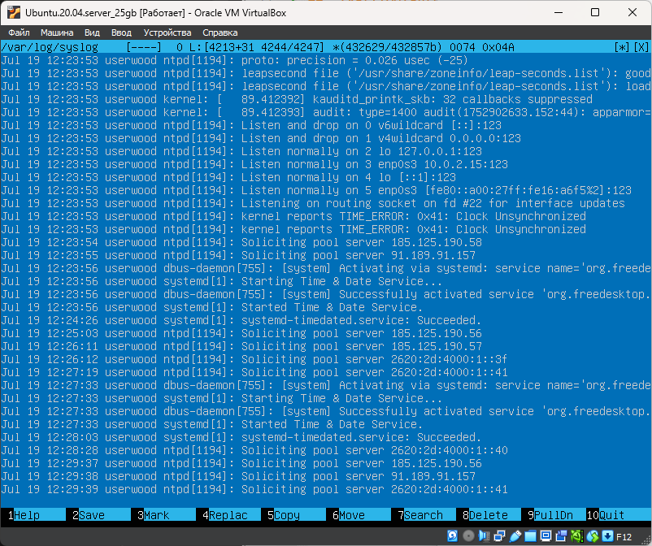
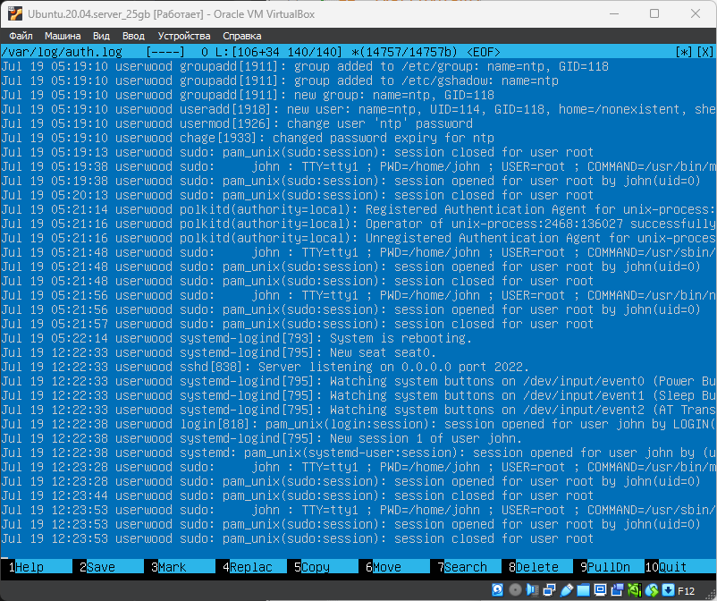
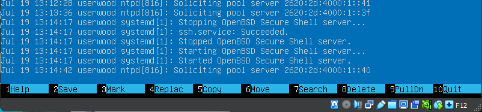
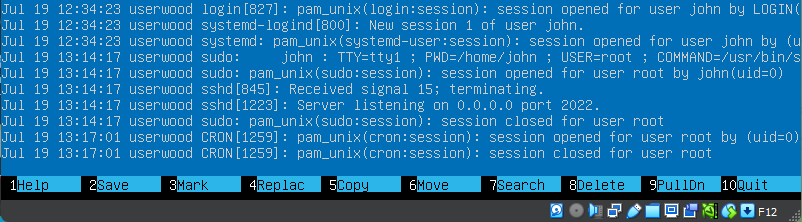

# Part 14. Работа с системными журналами

## `/var/log/dmesg`

 \ 

## `/var/log/syslog`

 \ 

## `/var/log/auth.log`

 \ 

- Jul 19 12:34:23 - время последней успешной авторизации
- пользователь john
- метод входа LOGIN через текстовую консоль (физическую, виртуальную или через SSH-сессию, работающую в режиме консоли).

### Перезапуск службы SSHd
`sudo systemctl restart ssh`

- /var/log/syslog

 \ 
__**Здесь показан запись о перезапуске SSH в логе /var/log/syslog**__

- /var/log/auth.log\
авторизация sudo для перезапуска SSHd

 \ 
__**Здесь показана запись о логине sudo для перезапуска SSH в логе /var/log/auth.log**__