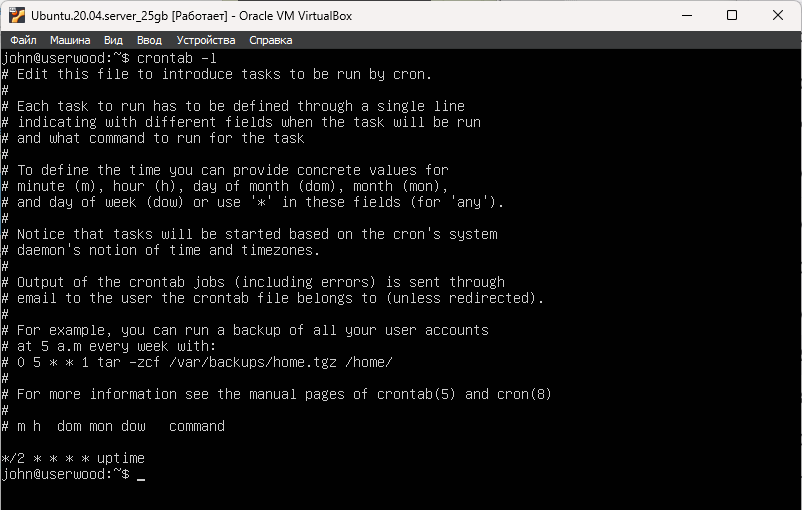
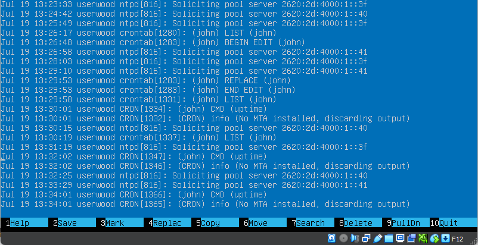
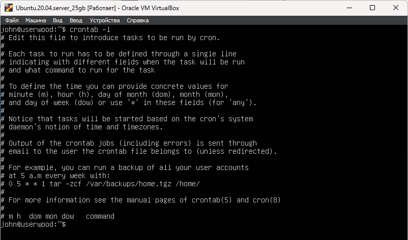

# Part 15. Использование планировщика заданий CRON

## Используя планировщик заданий, запусти команду uptime через каждые 2 минуты.

- `crontab -e` - редактировать CRON. При первом запуске можно выбрать любимый текстовый редактор. \
`select-editor` позволит переназначить текстовый редактор, если был выбран не тот\

### Все задачи должны заканчиваться символом перевода строки!

- `crontab -l` - отобразить текущие задачи

 \ 

- Лог выполнения задачи uptime /var/log/syslog 

 \ 

## Удали все задания из планировщика заданий.

 \ 