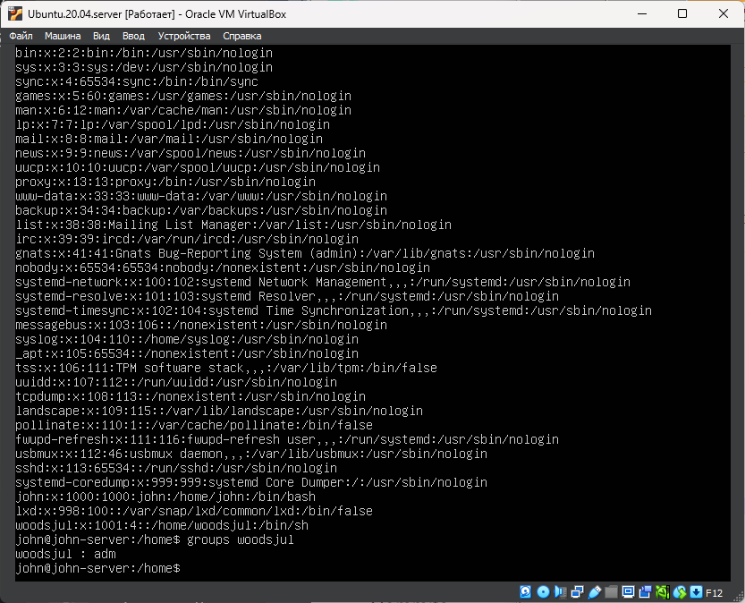

# Part 2. Создание пользователя

- Добавить нового пользователя \
`sudo useradd -m woodsjul -g adm`

Здесь sudo выполняет команду от имени администратора. Потребуется ввести пароль. \
опция `-m` создаст домашний каталог "woodsjul" для пользователя по указанному в файле `/etc/default/useradd` пути HOME=/home\
опция `-g` задаст пользователю группу "adm"

- Задать пароль нового пользователя \
`sudo passwd woodsjul` \
Ввести пароль два раза. \
Если не будет ошибок, пользователь woodsjul будет активирован и установлен пароль.

- Просмотреть список пользователей \
`cat /etc/passwd`

- Просмотреть группы пользователя \
`groups woodsjul` 

  \
__**Здесь показан процесс добавления нового пользователя**__

