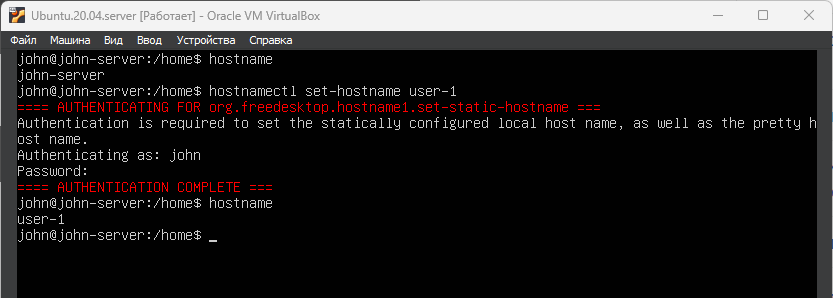
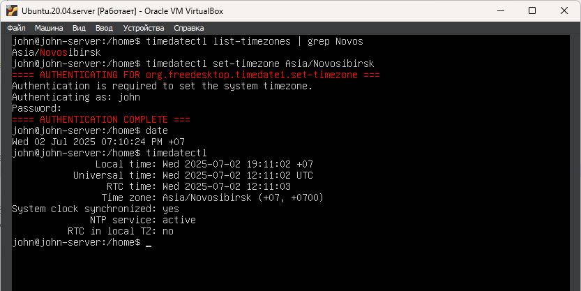
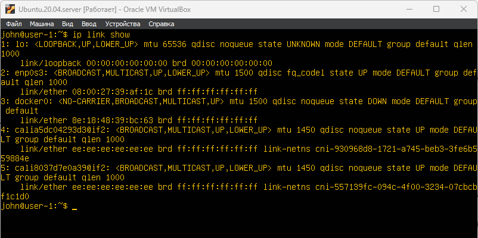
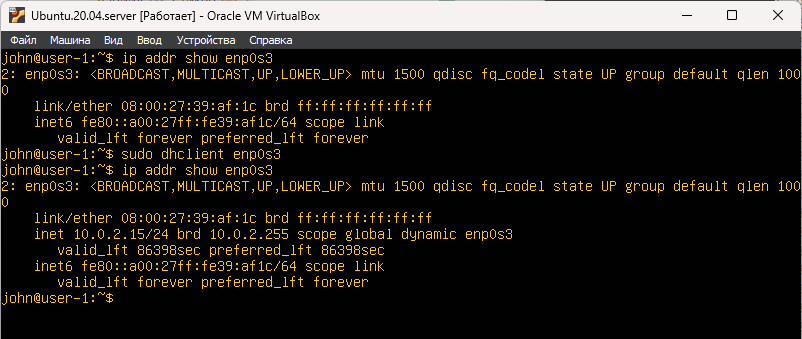
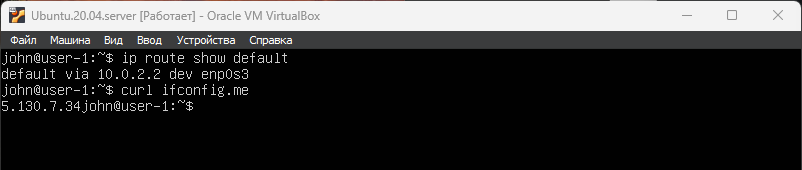
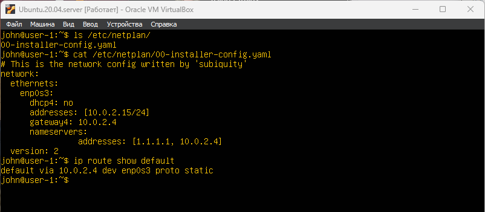
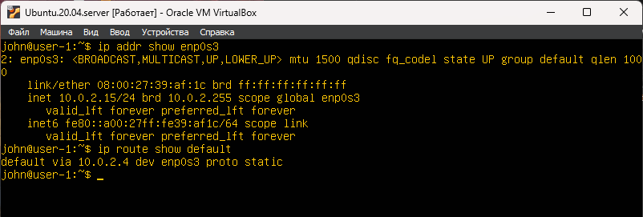
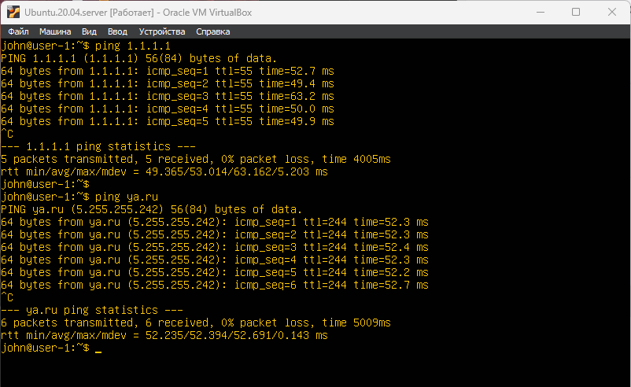

# Part 3. Настройка сети ОС

## 1. Изменить название машины 
- `hostnamectl set-hostname user-1`

- Посмотреть текущее название машины \
`hostname`

  \
 __**Здесь показан процесс переименования машины**__

## 2. Установи временную зону, соответствующую твоему текущему местоположению

- Информация о системных часах, а также часовой пояс \
`timedatectl`

- Отобразить список часовых поясов \
`timedatectl list-timezones`

- Найти свой город \
`timedatectl list-timezones | grep Novosibirsk` 

- Установить часовой пояс \
`timedatectl set-timezone Asia/Novosibirsk`

- Для изменения текущей даты и времени команда date \
`sudo date --set "2025-07-02 19:12:00"` \
(год-месяц-день) и время (часы:минуты:секунды).

 \
__**Здесь показаны установка часового пояса и текущее состояние даты, времени**__

## 3. Выведи названия сетевых интерфейсов с помощью консольной команды.

- Просмотреть список сетевых интерфейсов \
`ip link show`

 \
__**Здесь показано состояние петлевого интерфейса `lo`**__

- `lo: <LOOPBACK, UP, LOWER_UP> mtu 65536 qdisc noqueue state UNKNOWN mode DEFAULT group default qlen 1000`

- Это имя сетевого интерфейса.
lo означает Loopback (петлевой или локальный интерфейс).
Это специальный виртуальный интерфейс, который всегда присутствует в операционной системе.
Он используется для связи процесса с самим собой внутри одной и той же машины по сети. Например, когда вы обращаетесь к веб-серверу, запущенному на той же машине, через http://127.0.0.1 или http://localhost.
Он не связан с физическим оборудованием или внешней сетью.

- <LOOPBACK, UP, LOWER_UP>
Это набор флагов (атрибутов), описывающих состояние интерфейса. \
LOOPBACK: Подтверждает, что это петлевой интерфейс. \
UP: Указывает, что интерфейс активен и готов к передаче данных (логически включен). \
LOWER_UP: Этот флаг обычно относится к физическим интерфейсам и означает, что на физическом уровне интерфейс подключен (например, загорелся индикатор Link на сетевой карте). Для lo он может указывать на то, что виртуальный "канал" петли полностью функционален.

- mtu 65536
MTU (Maximum Transmission Unit) - Максимальный размер блока данных (фрейма), который может быть передан за один раз через этот интерфейс, без фрагментации. \
Значение 65536 означает, что максимальный размер фрейма для этого интерфейса составляет 65536 байт.

## 4. Используя консольную команду, получи ip адрес устройства, на котором ты работаешь, от DHCP-сервера.
__DHCP расшифровывается как Dynamic Host Configuration Protocol. \
(Динамический Протокол Конфигурации Хостов)__

- получить список сетевых интерфейсов \
`ip link show`

- Посмотреть текущие настройки для сетевого интерфейса __enp0s3__ \
`ip link show enp0s3`

- Получить IP адрес для интерфейса __enp0s3__ \
`sudo dhclient enp0s3` 

- Проверка IP-конфигурации, маршрутизации или ошибок на сетевом уровне \
`ip addr show enp0s3` \
строка inet 10.02.2.15/24 показывает назначенный IP адрес

- Отмена получения адреса \
`sudo dhclient -r enp0s3`

 \
__**Здесь показано получение IP адреса от DHCP сервера**__

## 5. Определи и выведи на экран внешний ip-адрес шлюза (ip) и внутренний IP-адрес шлюза, он же ip-адрес по умолчанию (gw).

- Получить внутренний IP адрес __enp0s3__ \
`ip route show default` \
**10.0.2.2**

- Получить внешний IP адрес __enp0s3__ \
Чтобы узнать внешний IP-адрес в Linux, придется воспользоваться онлайн-сервисами. \
`curl ifconfig.me` \
**5.100.7.34**

 \
__**Здесь показан внутренний и внешний IP устройства**__

## 6. Задай статичные (заданные вручную, а не полученные от DHCP-сервера) настройки ip, gw, dns (используй публичный DNS-серверы, например 1.1.1.1 или 8.8.8.8).

- Начиная с Ubuntu 17.10 и более поздних версий, сетевое взаимодействие контролируется функцией Netplan. Файлы конфигурации для Netplan находятся в каталоге  /etc/netplan и написаны на языке YAML \
`ls /etc/netplan/` 

Netplan считывает информацию из всех файлов в папке, попадающих под маску *.yaml . То есть на каждый интерфейс может быть отдельный файл для удобства. Если файла нету, необходимо его сгенерировать командой `sudo netplan generate` \
в моем случае файл "00-installer-config.yaml" 

- Редактируем файл под администратором \
`sudo vim /etc/netplan/00-installer-config.yaml` 

- Применить новые настройки сети \
`sudo netplan apply`

 \
__**Здесь показаны настройки статичного IP адреса без DHCP**__

## 7. Перезагрузи виртуальную машину. Убедись, что статичные сетевые настройки (ip, gw, dns) соответствуют заданным в предыдущем пункте.

- Перезагрузить сервер \
`reboot`

- Проверить настройки сети \
`ip addr show enp0s3` \
`ip route show default`

 \
__**Здесь показаны настройки сети**__

- Успешно пропингуй удаленные хосты 1.1.1.1 и ya.ru \
`ping 1.1.1.1` \
`ping ya.ru`

 \
__**Здесь показаны ping 1.1.1.1 и ya.ru**__

