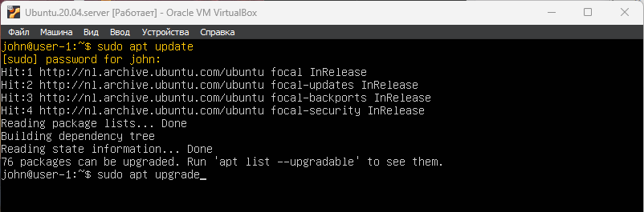
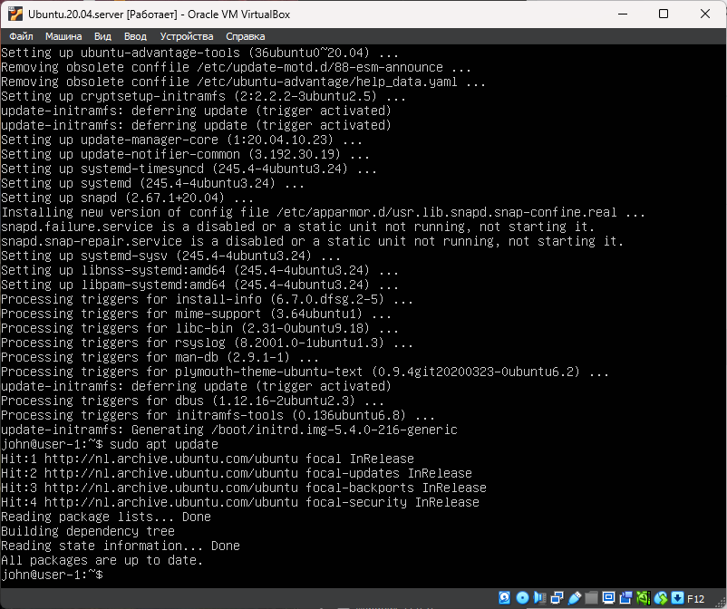

# Part 4. Обновление ОС

- Проверить обновления \
`sudo apt update` \
**76 packets can be upgraded**

 \
__**Здесь показаны доступные обновления **__

- Установить доступные обновления \
`sudo apt upgrade` \
**согласиться с установкой Yes**

- Проверить обновления \
`sudo apt update` \
**All packages are up to date**

  \
__**Здесь частично показан процесс обновления, и затем проверка обновлений**__

