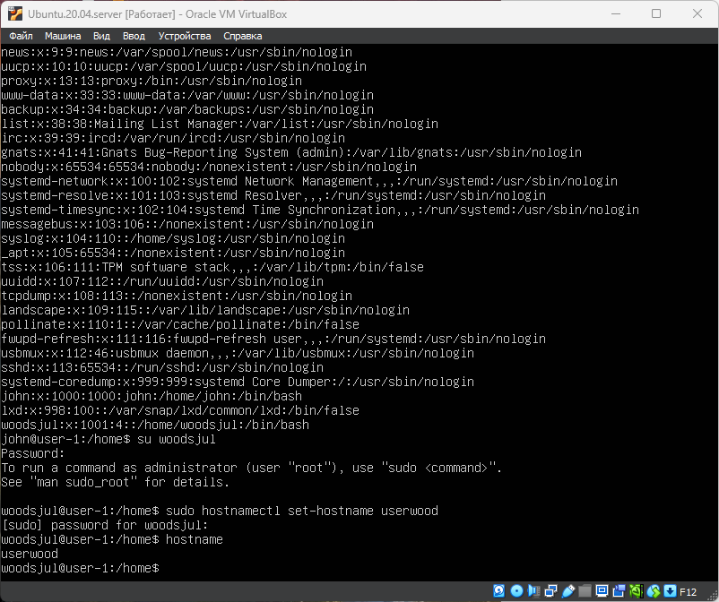

# Part 5. Использование команды sudo

Команда sudo ( **S**ubstitute **U**ser and **DO**, подменить пользователя и выполнить ) позволяет строго определенным пользователям выполнять указанные программы с административными привилегиями без ввода пароля суперпользователя root.

По умолчанию новый пользователь создается без права исполнения команд sudo, это сделано в целях безопасности. Чтобы пользователь имел возможность выполнять все команды необходимо добавить его в группу sudo: \
`usermod -a -G sudo <имя пользователя>`

- Переключиться на другого пользователя \
`su <имя пользователя>` 

 \
__**Изменение hostname от пользователя woodsjul **__

