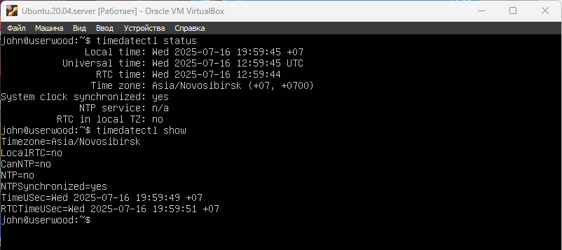

# Part 6. Установка и настройка службы времени
Настрой службу автоматической синхронизации времени.

- Информация о системных часах, а также часовой пояс \
`timedatectl status`

NTP - это протокол синхронизации времени по сети. 
Сервис NTP ntpd вычисляет уход ваших системных часов и постоянно подправляет их

Для установки ntpd из терминала введите: \
`sudo apt-get install ntp`

Отредактируйте `sudo /etc/ntp.conf` для добавления/удаления серверов. \
По умолчанию эти сервера такие: \
`server 0.ubuntu.pool.ntp.org` \
`server 1.ubuntu.pool.ntp.org` \
`server 2.ubuntu.pool.ntp.org` \
`server 3.ubuntu.pool.ntp.org`

Российские \
`server 0.ru.pool.ntp.org` \
`server 1.ru.pool.ntp.org` \
`server 2.ru.pool.ntp.org` \
`server 3.ru.pool.ntp.org`

После изменений конфигурационного файла вам надо перезапустить ntpd: \
`sudo service ntp restart`

Используйте ntpq для просмотра дополнительной информации: \
`sudo ntpq -p`

Команда `timedatectl show` покажет текущее время, часовой пояс и статус синхронизации \
**NTPSynchronized=yes**

 \
__**Текущее время и статус автоматической синхронизации времени **__

