# Part 7. Установка и использование текстовых редакторов

## Создание файла test_x.txt с текстом woodsjul

### Текстовый редактор VIM

Запустить VIM \
`vim`

Создать новый файл. \
`:e файл`

Перейти в режим вставки текста \
`i`

Клавиша **ESC** переводит в режим команд. Для выхода с сохранением \
`:wq`

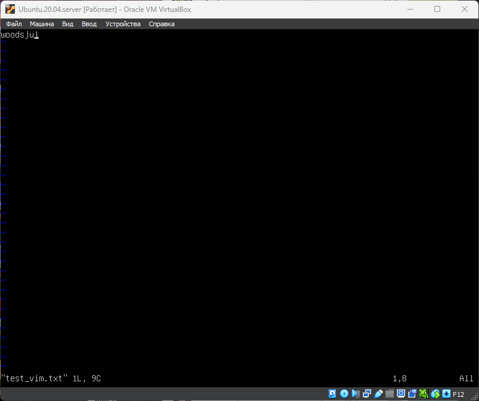 \
__**Редактор VIM создание и редактирование файла **__

### Текстовый редактор NANO

Запустить NANO \
`nano`

Написать текст затем сохранить в новый файл \
`ctrl+o`

Выйти из редактора \
`ctrl+x`

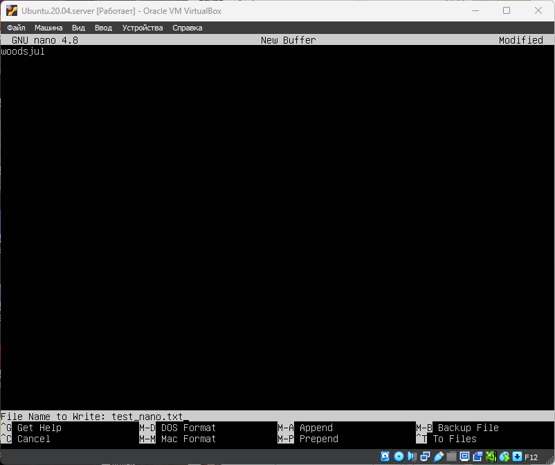 \
__**Редактор NANO создание и редактирование файла **__

### Текстовый редактор MCEDIT

Запустить MCEDIT \
`mcedit`

Написать текст затем сохранить в новый файл \
`F2` \
Так как файл еще не создан, выведтся диалог для ввода имени файла

Выйти из редактора \
`F10`

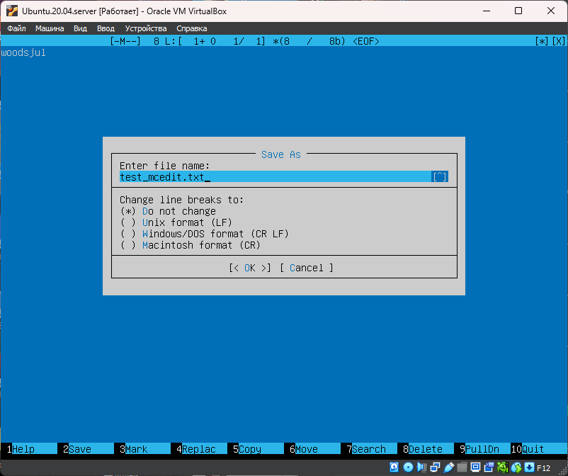 \
__**Редактор MCEDIT создание и редактирование файла **__

## Замена текста "woodsjul" на "21 School 21"

### VIM

Открыть файл \
`vim test_vim.txt`

Навести курсор на начало слова "woodsjul" \
Замена текста клавиша `R` \
Написать "21 School 21" \
Выйти без сохранения `:q!`

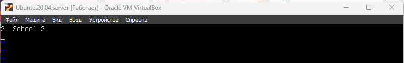 \
__**Редактор VIM замена текста без сохранения **__

### NANO

Открыть файл \
`nano test_nano.txt`

Удалить "woodsjul". Написать "21 School 21" \
Выход `ctr+x`. \
На предложение сохранить изменения нажать `n`

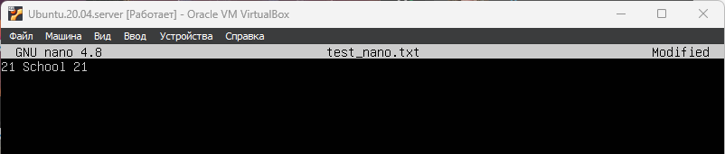 \
__**Редактор NANO замена текста без сохранения **__

### MCEDIT

Открыть файл \
`mcedit test_mcedit.txt`

Удалить "woodsjul". Написать "21 School 21" \
Выход `F10` \
на предложение сохранить изменения выбрать `No`

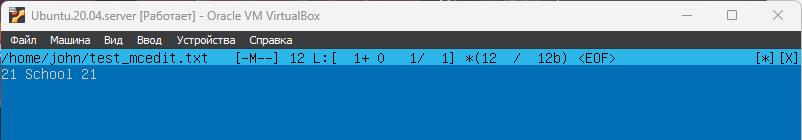 \
__**Редактор MCEDIT замена текста без сохранения **__

## Функция поиск и замена текста "woodsjul" на "21 School 21"

### VIM

Открыть файл \
`vim test_vim.txt`

Выполнить команду: \
`:s/woodsjul/21 School 21/` \
где: \
**:** - режим командной строки \
**s** - сокращение команды substitute \
`/что ищем/на что заменить/`

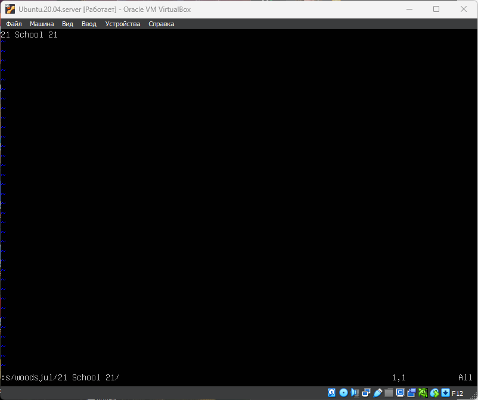 \
__**Редактор VIM поиск и замена текста**__

### NANO

Открыть файл \
`nano test_nano.txt`

Поиск и замена
Удалить . Написать "21 School 21" \
`ctr+\` - ввести текст для поиска "woodsjul" нажать Enter \
затем ввести замещающий текст "21 School 21" нажать Enter \
Согласиться на замену: \
Y(es) - одно слово \
A(ll) - все найденные слова \

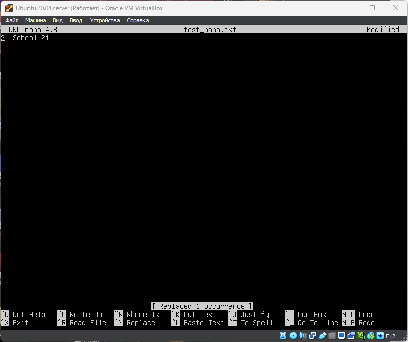 \
__**Редактор NANO поиск и замена текста**__

### MCEDIT

Открыть файл \
`mcedit test_mcedit.txt`

`F4` - вызвать диалог поиска и замены **Replace** \
В поле Enter search string: **woodsjul** \
В поле Enter replacement string: **21 School 21** \
Клавишей **TAB** выбрать кнопку **Ok** нажать **Enter** \
В следующем диалоге "Confirm replace" согласиться с заменой \
Replace - последовательная одиночная замена каждого найденного слова \
All - заменить все найденные слова.	

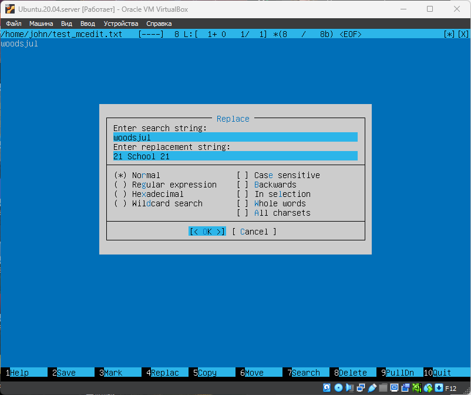 \
__**Редактор MCEDIT поиск и замена текста**__

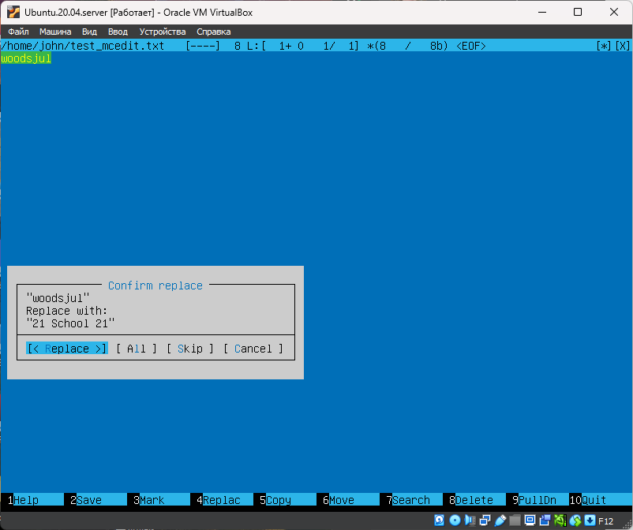 \
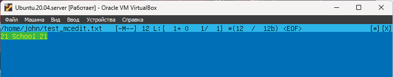 \