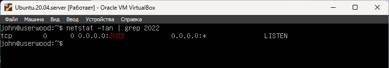

# Part 8. Установка и базовая настройка сервиса SSHD

- Установка SSHD в Ubuntu Linux \
`sudo apt-get install ssh`

- Проверить не занят ли порт 2022 \
`sudo netstat -tulpan | grep 2022` \
если вывод пустой то порт свободен

- Отредактировать sshd_config \
`sudo nano /etc/ssh/sshd_config` \
раскоментировал Port 22 и исправил на 2022 \
раскоментировал ListenAddres 0.0.0.0

- Перезапуск SSHD с новыми настройками \
`sudo systemctl restart ssh`

- Автостарт службы при загрузке системы \
`sudo systemctl enable ssh`

- Отобразить процесс sshd \
`ps -aux | grep sshd` \
-a - выбрать все процессы кроме фоновых \
-x показывает процессы, не привязанные к терминалу, \
-u выводит информацию о процессах в формате, удобном для пользователя.

- Перезагрузить систему \
`sudo reboot`

Команда NETSTAT предназначена для получения сведений о состоянии сетевых соединений и слушаемых на данном компьютере портах TCP и UDP, а также, для отображения статистических данных по сетевым интерфейсам и протоколам.
- Вывод команды netstat \
`netstat -tan | grep 2022` \
-t - Показывать только TCP соединения. \
-a - Показывать все сокеты (включая прослушиваемые и установленные соединения). \
-n - Отображать числовые адреса (не выполнять обратное разрешение имен хостов и служб). \
| grep 2022 - отфильтровать строки содержащие 2022 \

`TCP	0	0	 0.0.0.0:2022	0.0.0.0*	LISTEN` \
**TCP** - Имя протокола \
**0.0.0.0:2022** - Локальный адрес \
локальный IP-адрес участвующий в соединении или связанный со службой, ожидающей входящие соединения (слушающей порт). Если в качестве адреса отображается 0.0.0.0 , то это означает - "любой адрес", т.е в соединении могут использоваться все IP-адреса существующие на данном компьютере. \
**0** - количество байт в очереди приема \
**0** - количество байт в очереди отправки \
**0.0.0.0\*** - означает, что соединение готово принимать подключения от любого удаленного хоста и любого порта. \
**LISTEN** - состояние сокета. Слушает.

 \
__**Здесь показан вывод команды netstat -tan | grep 2022**__
