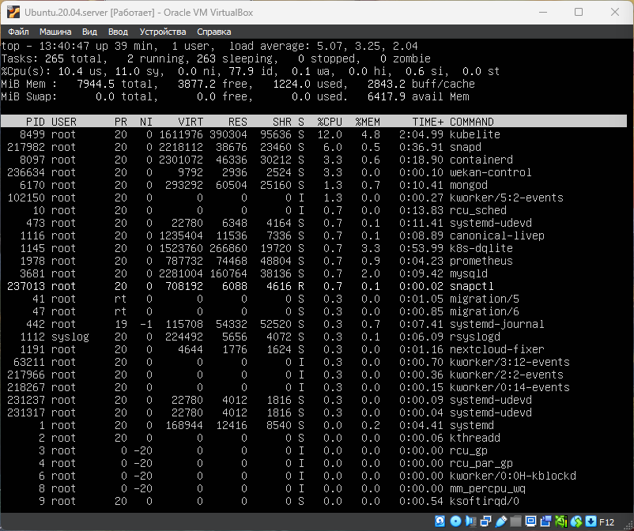
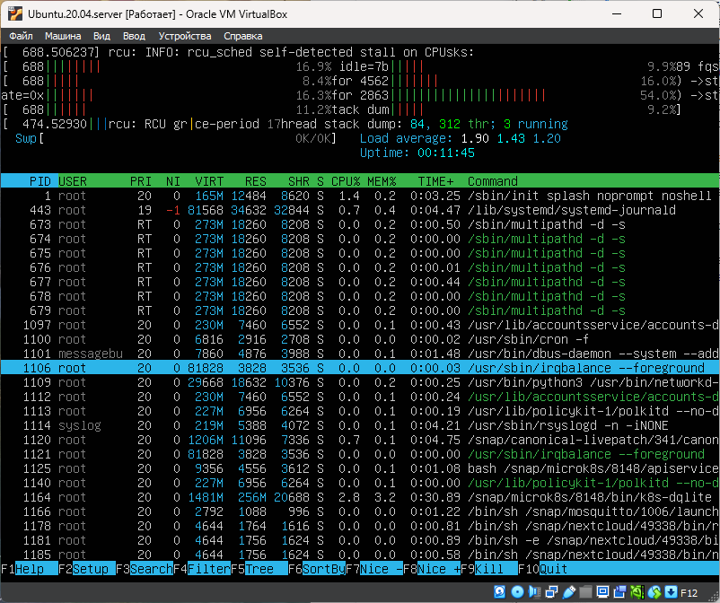
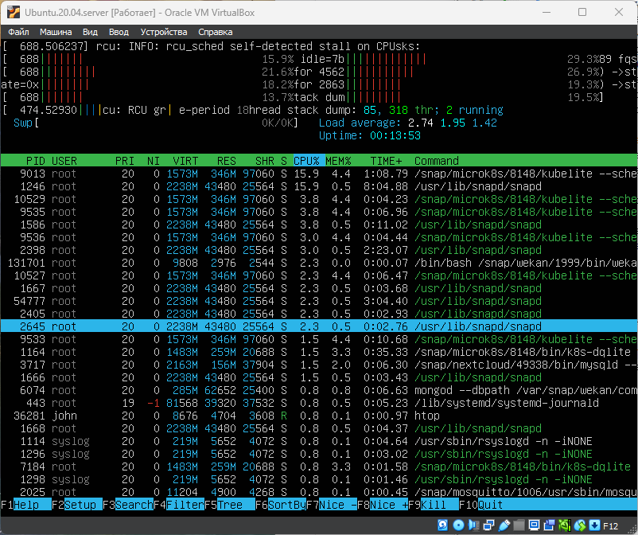
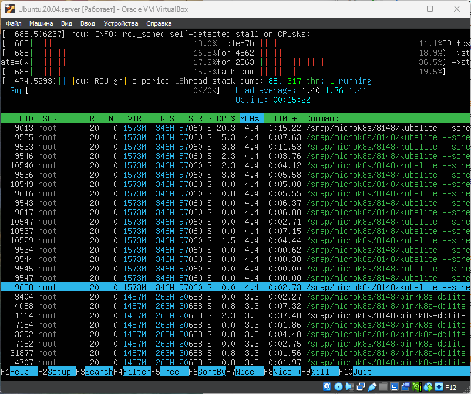
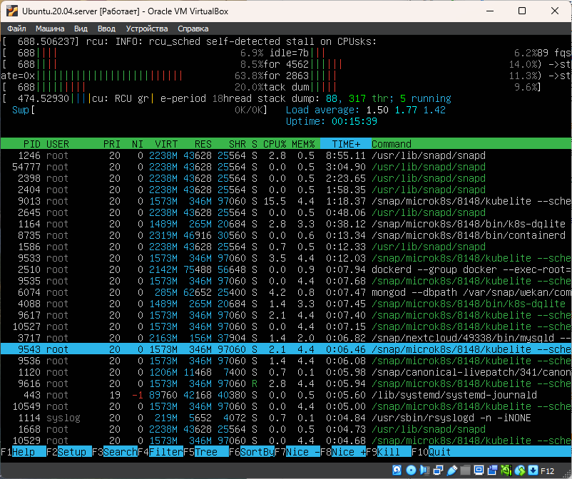
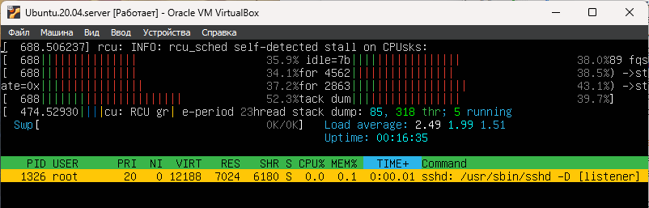
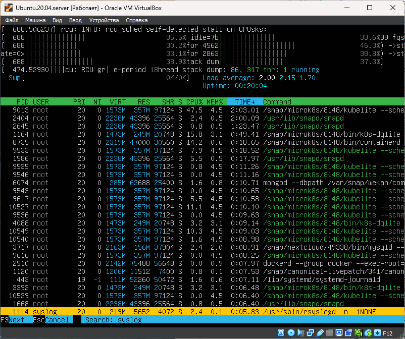
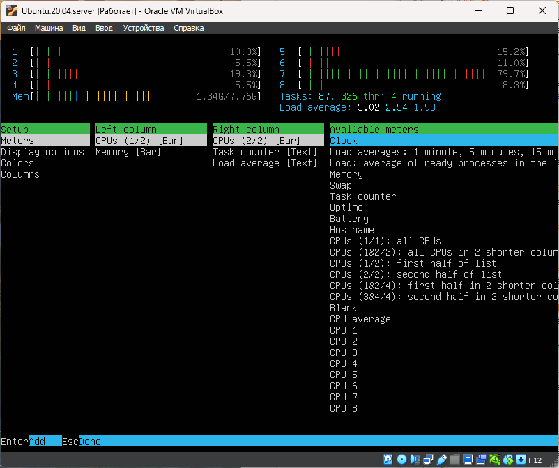
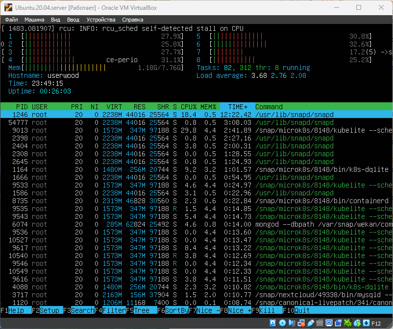

# Part 9. Установка и использование утилит top, htop

Для анализа нагрузки сервера с ОС Linux чаще всего используют утилиты:\
- top – стандартная утилита, установлена во всех версиях Linux по умолчанию\
- htop – удобнее в использовании по сравнению с top, интерактивна,\
- atop – позволяет вести логи.

## Утилита TOP
`top` [описание TOP](https://help.ishosting.com/ru/load-and-process-control-top-htop-atop)
- 39min - uptime
- 1 user - количество авторизованных пользователей,
- 5.07 среднюю загрузку системы (load average),
- 265 общее количество процессов (Tasks),
- 10.4 us - загрузка CPU процессами пользователей. 77.9 id - неиспользуемые ресурсы. (чем больше тем менее нагружен сервер)
- 7944,5мб - всего памяти. 3877,2мб свободной
- 8499 - pid процесса занимающего больше всего памяти (kubelite),
- 8499 - pid процесса, занимающего больше всего процессорного времени  (kubelite). 

### Кнопки управления TOP:
- m - сортировка по использованию памяти
- p - сортировка по использованию процессора
- k - завершить процесс, затем ввести PID процесса
- q - выйти из top

 \
__**Здесь показан вывод утилиты TOP**__

## Утилита HTOP

- **F6** - вызов меню сортировки по различным критериям.

### Сортировка PID
 \

### Сортировка PERCENT_CPU
 \

### Сортировка PERCENT_MEM
 \

### Сортировка TIME
 \

- **F4** - отфильтровать процесс по имени. ввести в поле имя процесса

### Фильтр для процесса sshd
 \

- **F3** - Поиск процесса по имени. ввести в поле имя процесса

### Поиск для процесса syslog
 \

- **F2** - Настройки для добавления/удаления дополнительный полей вывода

### Настройки вывода
 \

### Вывод hostname, clock, uptime
 \